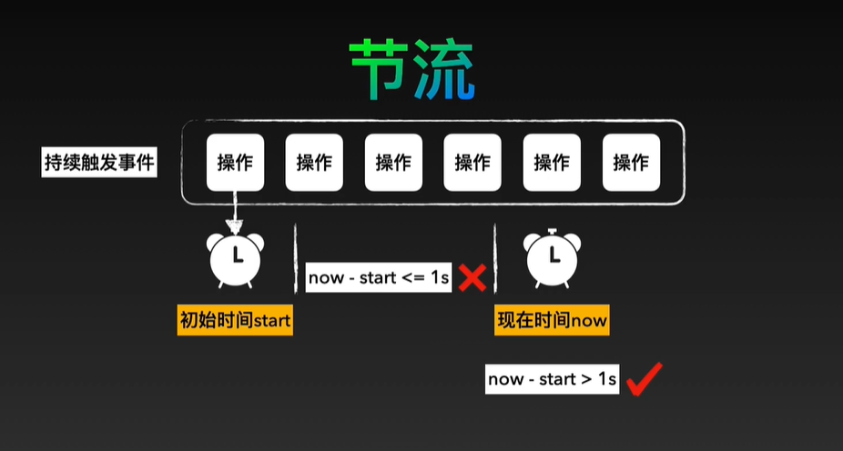
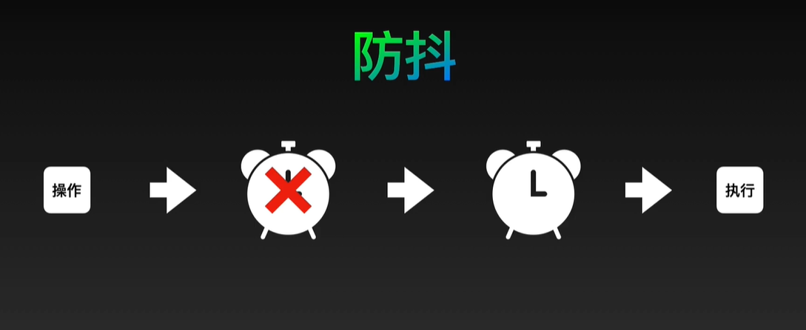

### 节流
> n 秒内只运行一次，若在 n 秒内重复触发，只有一次生效。

#### 应用场景 e.g.
  1. 滚动加载、加载更多或监听滚动条
  2. 搜索框，搜索联想



时间戳版：
```js
/**
 *
 * @param fn 要节流的函数
 * @param delay 间隔事件（ms）
 * @returns void
 */
function throttle(fn, delay = 200) {
  let last = 0;

  return function (...args) {
    const now = Date.now();
    if (now - last >= delay) {
      last = now;
      fn.apply(this, args);
    }
  };
}
```

定时器版：
```js
function throttle1(fn, delay = 200) {
  let timer;
  return function (...args) {
    if (!timer) {
      timer = setTimeout(() => {
        fn.apply(this, args);
        clearTimeout(timer);
        timer = null;
      }, delay);
    }
  };
}
```

结合版：
```js
function throttle(fn, delay = 200) {
  let timer = null;
  let startTime = Date.now();
  return function (...args) {
    let curTime = Date.now();
    let remaining = delay - (curTime - startTime);
    if (remaining <= 0) {
      fn.apply(this, args);
    } else {
      timer = setTimeout(fn, remaining);
    }
  };
}
```

<hr />

### 防抖
> n 秒后执行事件，若在 n 秒内重复触发，则重新计时。

#### 应用场景 e.g.
  1. 搜索框搜索，搜索最后一次输入
  2. 文本框校验
  3. resize 监听



```js
/**
 *
 * @param fn 需要防抖的函数
 * @param delay 执行的延迟
 * @param immediate 是否立即执行
 * @returns void
 */
function debounce(fn, delay = 200, immediate = false) {
  let timer;
  return function (...args) {
    // 保存执行环境的 this 指向
    const context = this;

    // delay 时间内重复触发，重新计时
    if (timer) clearTimeout(timer);

    if (immediate) {
      // 立即执行：多次触发事件，第一次会立即执行，之后在设定的 delay 内触发事件不执行
      const callNow = !timer;

      timer = setTimeout(() => {
        timer = null;
      }, delay);

      if (callNow) {
        // apply 更改 this 指向后立即执行
        fn.apply(context, args);
      }
    } else {
      // 非立即执行，多次触发事件后，最后一次触发后等待 delay 后执行
      timer = setTimeout(() => {
        fn.apply(context, args);
      }, delay);
    }
  };
}
```